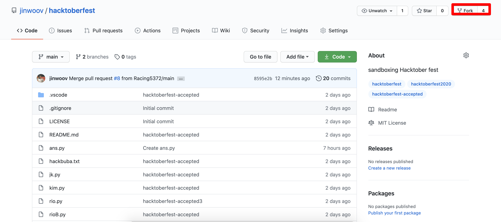
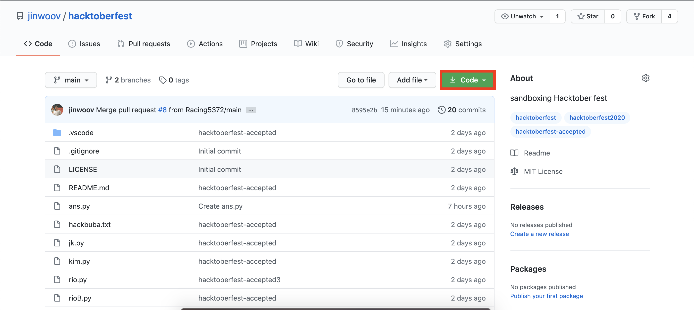

# HACKTOBERFEST

## Introduction 
This repository is designed for open source event for [Hacktoberfest](https://hacktoberfest.digitalocean.com/). Please respect others and enjoy!

**Disclaimer: Any push that alters integrity of this repo or content of other person's file will not be merge to this repository.**

---
## How to contribute?

**Prior to starting these challenges please sign up at [Hacktoberfest](https://hacktoberfest.digitalocean.com/), and login to it using your Github account.**

First, fork this repo to your Github.


Second clone it down to your computer


Third, create you own branch with your name

Fourth, push your code up and make a pull request.

[Great article to follow](https://medium.com/@mvthanoshan9/how-to-make-your-first-pull-request-on-github-9aefca5cc837)

---

## Challenges

### *Challenge #1*
- Log your name into the [`Contributor.md`](./Contributor.md) file. The format should be as follow.

```md
- Name: (Full Name)
- Bio: Tell me about yourself!
- Link: [Github](link goes here)
```

After adding this to the `contributor.md` file, make a pull request and wait for it to merge!

---

### *Challenge #2*

Introduce yourself! In `About-Me` folder, create a file with your `initials.md`. After that add a contents as follow:

```md
- Name: (Name)
- Location: (where are you from? if its too personal, put Remote)
- Fun Fact: Tell me about yourself any fun fact
- Link: [Github](Put your Github link)
```

Then make a pull request


---
### *Challenge #3*

Create any simple scripts into the `Scripts` folder, printing `Hello World` message.
**Example**

```js
// JavaScript

function helloWorld(){
    console.log("Hello World");
}

helloWorld();
```

```py
# Python
def hello_world():
    print("Hello World")

hello_world()
```

```cs
// C Sharp
public class Program
{
    public static void Main(string[] args)
    {
        HelloWorld();
    }
    public static void HelloWorld()
    {
        Console.WriteLine("Hello World");
    }
}
```

```Java
// Java
public class Program {
    public static void main(String[] args) {
        helloWorld();
    }
    public static void helloWorld() {
        System.out.print("Hello World");
    }
}
```

Feel free too use any of these code or be creative!

---

### *Challenges #4*

Should you choose to do this mission... 

Let create something cool together!  
In `Application` folder, I've started node app. Please build on top this application by adding **one line** of code. Again **ONE LINE** of code! This is to give other people to put their cool idea.

If you are brand new to coding. You can still participate by adding a comment to the function or variable and tell what you think that line is doing!! 

In node.js you can create a comment by adding `//` to the beginning of the statement. 

Lets get creative!

---

Thank you all for participating and thank you Clubhouse1 for doing it live.

